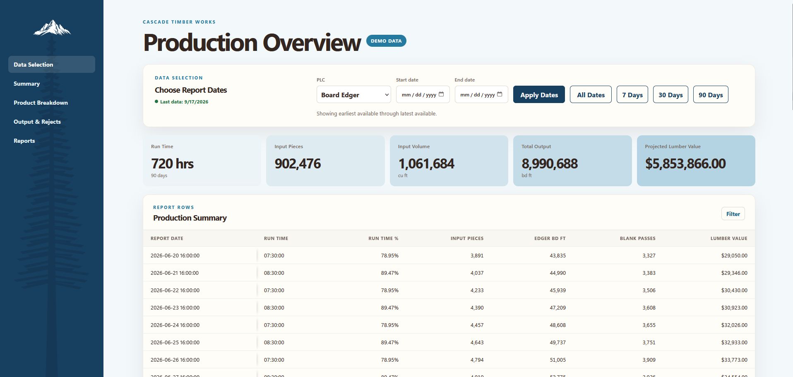
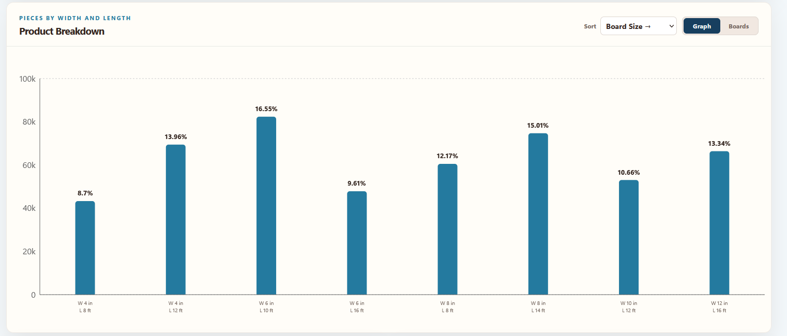
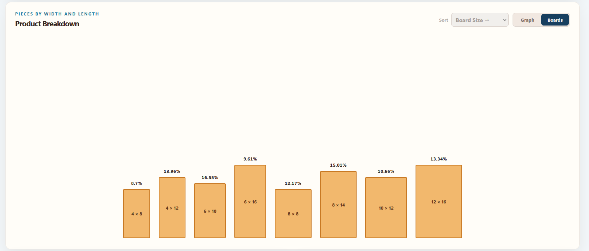
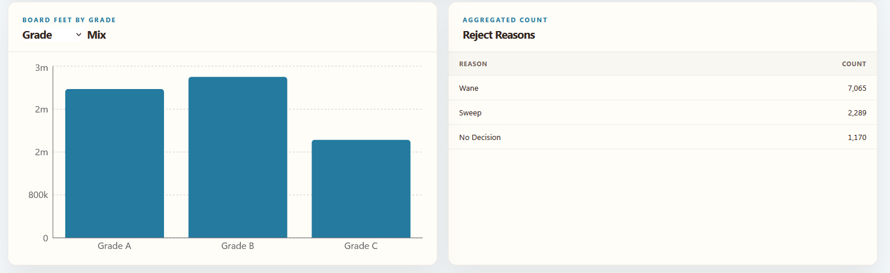
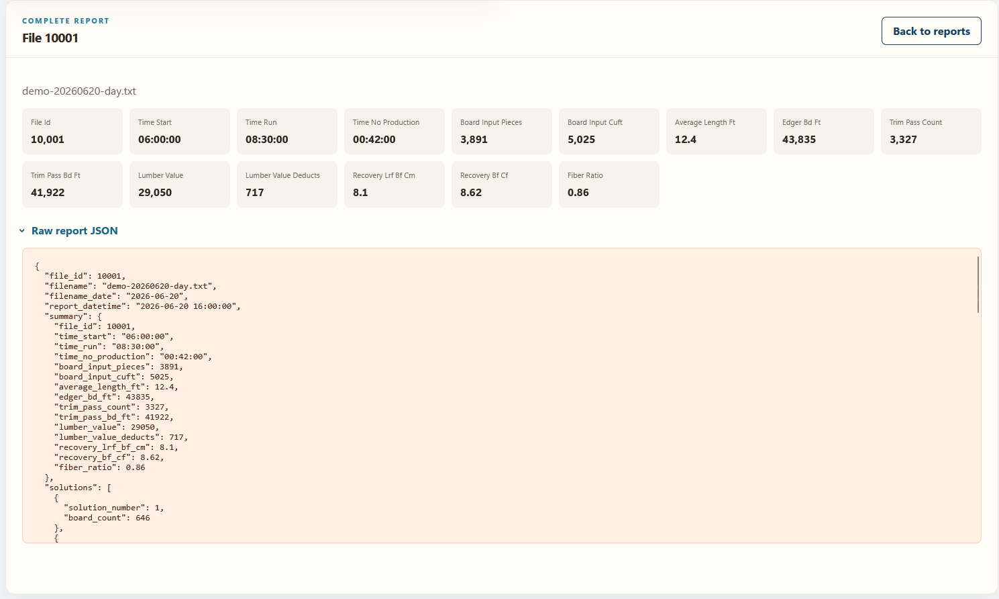

# Lumber Tally Dashboard

A responsive, read-only production dashboard for exploring lumber tally data,
operational summaries, product output, board mix, reject reasons, and individual
source reports.

The application is delivered as one runtime-configurable container image. A
deployment selects its branding, operational profile, and upstream API when the
container starts, allowing multiple facilities to use the same tested artifact
without maintaining separate code branches or images.



*Fictional branding and deterministic demo data are used throughout these screenshots.*

## Status

The dashboard is production-oriented and includes:

- an nginx-based multi-stage container image;
- deterministic demo data that never contacts a production API;
- unit, component, accessibility, build, and browser tests;
- a release gate that must pass before an image is published;
- immutable commit tags and registry digests for production deployment;
- read-only API proxy enforcement and API-aware container health;
- session-only handling of operational data in the browser; and
- documented deployment security and acceptance checks.

Production use still requires site-specific network controls, monitoring,
rollback procedures, and acceptance testing. See the
[production security baseline](docs/SECURITY.md).

## Capabilities

- Independent reporting dates with 7-, 30-, 90-, and all-date presets
- Production summaries for run time, production days, input, output, and value
- Configurable tabular columns with sticky identifiers and responsive overflow
- Product analysis by width and length in chart and proportional-board views
- Piece count, board-foot, percentage, sorting, and Pareto analysis
- Board-foot distributions by grade, thickness, width, or length
- Naturally ordered dimensions, fractional sizes, and numbered grades
- Reject-reason summaries
- Complete report details with expandable source JSON
- Background report prefetching for responsive navigation
- Shared viewport-aware visualization tooltips
- Scroll-aware navigation with synchronized URL fragments
- Desktop, tablet, and mobile layouts
- Explicit loading, empty, retry, validation, and network-error states

The current production adapter supports one PLC data contract. The interface is
structured for additional production systems as their contracts become
available.

## Product tour

### Product breakdown

Compare output by board dimensions in a conventional bar chart or as
proportional boards.





### Grade mix and rejects

Review board-foot distribution by grade alongside aggregated reject reasons.



### Report detail

Open an individual source report, review its normalized metrics, and inspect the
raw source record when troubleshooting or validating results.



## Architecture

```text
Browser
  ├── static React application
  └── same-origin /api requests
          └── nginx read-only proxy
                  └── private tally API
```

The upstream service exposes source tables rather than dashboard-specific
aggregates. The browser adapter paginates those tables, normalizes payloads,
joins related records, applies the selected reporting range, and calculates the
display aggregates. In-flight reads are shared and completed tables have a
one-minute in-memory freshness window.

Production API data is not written to IndexedDB, Cache Storage, local storage,
or the service-worker cache. Startup also removes IndexedDB databases created by
older releases.

## Technology

| Area | Technology |
|---|---|
| Interface | React and TypeScript |
| Build tooling | Vite |
| Server state | TanStack Query |
| Charts | Recharts |
| Styling | Responsive CSS |
| Production server | nginx |
| Unit and component tests | Vitest and Testing Library |
| Accessibility checks | axe-core |
| Browser tests | Playwright |
| Packaging | Docker and Docker Compose |

## Demo

### Requirements

- Node.js 22 LTS
- npm

Install the locked dependencies:

```bash
npm ci
```

Start the deterministic demo on Linux or macOS:

```bash
FAKE_DATA_SEED=demo-seed-v1 sh ./bin/start.sh --demo
```

On Windows:

```bat
bin\start.bat --demo
```

Open `http://localhost:5173`. Demo mode uses generated in-process fixtures and
does not create an API proxy or contact a production service. It uses the
fictional Cascade Timber Works profile so public screenshots and demonstrations
remain separate from real deployment branding.

### Demo container

Build and run the production container with demo data:

```bash
docker build -f docker/Dockerfile -t lumber-tally-dashboard .
docker run --rm --init -p 8080:8080 lumber-tally-dashboard
```

Open `http://localhost:8080`.

### Native nginx service

A Linux VM can run the same production architecture without a container. It
requires Node.js 22 LTS, npm, and nginx. Copy the root environment template and
configure the production profile and API running on the VM:

```bash
cp .env.example .env
```

```dotenv
MILL_ID=sequoia
DEMO_MODE=false
TALLY_API_BASE_URL=http://127.0.0.1:7304
DASHBOARD_PORT=8080
```

Start the service from the repository root:

```bash
./bin/start.sh
```

The launcher installs locked dependencies when necessary, builds `dist/`,
generates the selected manifest and runtime configuration, renders an isolated
nginx configuration under `.runtime/nginx/`, validates it, and runs nginx in the
foreground. Process or service-manager environment variables override values in
the root `.env`. The service account must own or have write access to the cloned
repository because the launcher writes `node_modules/`, `dist/`, and `.runtime/`.

For systemd, use `Type=simple`, set `WorkingDirectory` to the repository root,
and set `ExecStart` to the absolute path of `bin/start.sh`. Configure
`Restart=on-failure` and start it only after the local API and network are
available. The equivalent Windows launcher is `bin\start.bat` when a native
nginx installation is available.

Native production mode is the default. `--production` is an explicit alias,
`--dev` starts Vite against a real API for development, and `--demo` always
starts the deterministic Vite demo without contacting an API.

## Production deployment

The repository includes [docker/compose.yaml](docker/compose.yaml) for running a
published image. Copy the environment template and replace every deployment
placeholder before starting it:

```bash
cp docker/.env.example docker/.env
docker compose --env-file docker/.env -f docker/compose.yaml pull
docker compose --env-file docker/.env -f docker/compose.yaml up -d
```

PowerShell equivalent:

```powershell
Copy-Item docker/.env.example docker/.env
docker compose --env-file docker/.env -f docker/compose.yaml pull
docker compose --env-file docker/.env -f docker/compose.yaml up -d
```

Use an immutable image digest from a successful release workflow:

```dotenv
DASHBOARD_IMAGE=ghcr.io/lolson3/lumber-tally-dashboard@sha256:<published-digest>
DEMO_MODE=false
MILL_ID=<configured-profile>
TALLY_API_BASE_URL=http://<private-api-host>:<port>
DASHBOARD_HOST_PORT=8080
```

`TALLY_API_BASE_URL` must be reachable from inside the dashboard container. A
service running on the container host generally cannot be reached through
`127.0.0.1`, because that address refers to the dashboard container itself.

No application data volume is required. Deployment values belong in ignored
environment files or the host's configuration store; never commit private
addresses or credentials.

### Runtime configuration

| Variable | Required | Purpose |
|---|---:|---|
| `DASHBOARD_IMAGE` | Compose | Immutable commit tag or registry digest |
| `DEMO_MODE` | Yes | Enables deterministic fixtures when `true` |
| `MILL_ID` | Yes | Selects the installed branding and operational profile |
| `TALLY_API_BASE_URL` | Real data | Private upstream API origin |
| `DASHBOARD_HOST_PORT` | No | Host port mapped to nginx; defaults to `8080` |
| `FAKE_DATA_SEED` | Demo only | Reproducible demo-data seed |

The container validates its runtime settings and fails startup when a real-data
profile is missing its API origin. The selected profile controls branding,
theme, timezone, icons, PLC availability, date behavior, adapter selection, and
install metadata.

### Health checks

| Endpoint | Meaning |
|---|---|
| `/healthz` | nginx is running and serving requests |
| `/readyz` | nginx and the configured API dependency are available |

The image's Docker health check requires both conditions. Demo and in-process
mock profiles have no external API dependency. If the host uses an HTTP health
probe instead of Docker image health, configure it to request `/readyz`.

An unhealthy status does not automatically restart a plain Docker Compose
container. Restart and alert behavior must be configured in the deployment
platform.

### Network and security model

The current production model is intended for a trusted local network:

- nginx is reached by host IP and the configured port;
- firewall or VLAN policy limits access to approved local devices;
- the application does not maintain user accounts;
- the proxy permits only `GET` and `HEAD` requests to `/api/`;
- API responses are marked `Cache-Control: no-store`;
- browser cookies and authorization headers are not forwarded upstream; and
- the service must not be exposed through public DNS or router port forwarding.

Anyone who can reach the service can read the dashboard. If per-user identity,
revocation, audit logging, or access from an untrusted network becomes a
requirement, place an authenticated HTTPS reverse proxy in front of it.

Serving the application by HTTP at a private IP is supported, but browsers do
not treat that as a secure context. Installable PWA and service-worker features
may therefore be unavailable even though the dashboard itself functions.

## Releases

Pull requests and non-main pushes run the reusable release gate. A main-branch
publish invokes that same gate and cannot publish until it succeeds. The gate
runs the application tests, builds the production bundle and container, checks
the proxy security behavior, and verifies that container health becomes
unhealthy when its API dependency disappears.

A successful publish produces:

- a full Git commit tag;
- the convenience tag `latest`; and
- an immutable `image@sha256:...` reference in the workflow summary.

Production deployments must use the commit tag or digest, never `latest`.

## Development

Create a root `.env.local` from [.env.example](.env.example) and supply only the
values required by the selected development profile. Common variables include:

```dotenv
VITE_MILL_ID=<configured-profile>
VITE_TALLY_API_BASE_URL=http://<private-api-host>:<port>
VITE_DASHBOARD_PORT=5173
VITE_ALLOWED_HOSTS=<comma-separated-hostnames>
```

Start the development server:

```bash
npm run dev
```

Vite is a development and build-verification server. Production deployments use
the nginx container.

## Verification

```bash
# Unit, component, API-adapter, and accessibility tests
npm test

# Production build and browser workflows
npm run test:e2e

# Complete local application pipeline
npm run test:all
```

Automated browser tests use deterministic fixtures. A production deployment
must also complete the environment-specific checks in
[docs/SECURITY.md](docs/SECURITY.md), including LAN isolation, source-data
comparison, dependency failure, restart, and rollback testing.

## Project structure

```text
src/
  api/                  API adapter, normalization, and data-retention controls
  components/           Dashboard interface regions
  config/               Runtime profiles and branding
  hooks/                React lifecycle and interaction behavior
  test/                 Unit, component, accessibility, and browser tests
  utils/                Data transformations and formatting
  App.tsx                Application orchestration
  main.tsx               React and query-client bootstrap
  styles.css             Responsive visual system
public/
  icons/                PWA and platform icons
  img/                  Runtime-selected branding assets
  offline.html          Static offline shell
  sw.js                 Application-shell service worker
docker/
  Dockerfile            Multi-stage build and unprivileged nginx runtime
  compose.yaml          Published-image service definition
  nginx.conf.template   Static server, security headers, and API proxy
  healthcheck.sh        Liveness and dependency readiness check
bin/
  start.bat             Windows native-nginx, development, and demo launcher
  start.sh              Unix native-nginx, development, and demo launcher
  prepare-native-runtime.mjs
                        Native runtime and nginx configuration generator
docs/                   Internal architecture, integration, and security records
```

## Known boundaries

- The dashboard is read-only and does not modify source data.
- Only the currently integrated PLC contract is enabled.
- The source API does not provide dashboard-specific aggregates or date-filtered
  queries, so initial load time grows with source-table size and API latency.
- Operational records are processed in the browser and retained only for the
  active browser session.
- Network-only authorization is appropriate only for the agreed trusted-LAN
  deployment model.

## License

Licensed under the [Apache License 2.0](LICENSE).
